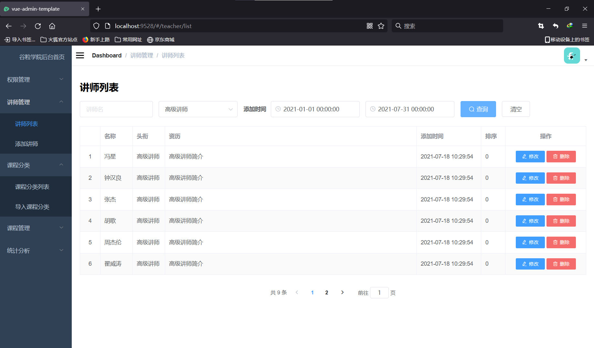

# 简介

基于 Spring Cloud Alibaba 的前后端分离微服务在线教育项目，整合了 Spring Security（用户认证（Authentication）和用户授权（Authorization）），缓存 Redis，以及 alibaba 全套服务发现，服务配置，服务调用，流量控制（hystrix），监控等

# 项目展示

### 后台登录页面

### 权限管理页面

### 教师管理页面

### 课程管理页面

### 数据统计模块

### 前台首页

### 注册页面

### 登陆页面

### 微信登录页面

### 微信登录成功页面

### 课程展示页面

### 购买课程权限验证

### 课程支付

### 课程视频观看页面

### 教师展示页面

# 需求分析

# 数据表结构

# 模块说明

	|- education_parent
		|- common			|| 公共模块
			|- utils			|| 存放各种工具
			|- base				|| 全局bean，全局设置等
			|- spring_security		|| spring_security专用设置, 与service_acl模块相连
		|- infrastructure		|| 微服务api网关
		|- service			|| 微服务模块									
			|- service_edu			|| 提供主要服务api接口
			|- service_oss                  || 文件上传至阿里云oss
			|- service_vod			|| 视频点播，上传至阿里云oss
			|- service_cms			|| 控制前台首页数据
			|- service_center		|| 用户登录注册模块
			|- service_order		|| 订单模块
			|- service_statistic		|| 统计模块
			|- service_acl			|| 后台管理权限控制

# 使用技术栈

|         框架          |                       使用内容                        |     版本      |
| :-------------------: | :---------------------------------------------------: | :-----------: |
|         mysql         |                        数据库                         |      5.6      |
|     Mybatis-Plus      |                   为Mybatis简化开发                   |     3.0.5     |
|         redis         |         缓存数据库，为spring、mybatis提供缓存         |     6.2.1     |
|      SpringBoot       |                Spring快速开发的脚手架                 | 2.2.1.RELEASE |
|         Nacos         |                 服务注册、发现、配置                  | 0.2.2.RELEASE |
| Spring Cloud Gateway  |          服务网关，负责请求转发，负载均衡等           | 0.2.2.RELEASE |
|        Swagger        |                     生成接口文档                      |     2.7.0     |
|        hystrix        |                    服务熔断、降级                     | 0.2.2.RELEASE |
| Spring Cloud Security | 用户认证（Authentication）和用户授权（Authorization） | 2.2.1.RELEASE |
|       OpenFeign       |           Http客户端，负责微服务之间的调用            | 0.2.2.RELEASE |

# 其他技术

httpclient+fastjson+easyexcel+阿里云OSS + 视频点播 + 云短信 + 微信支付

